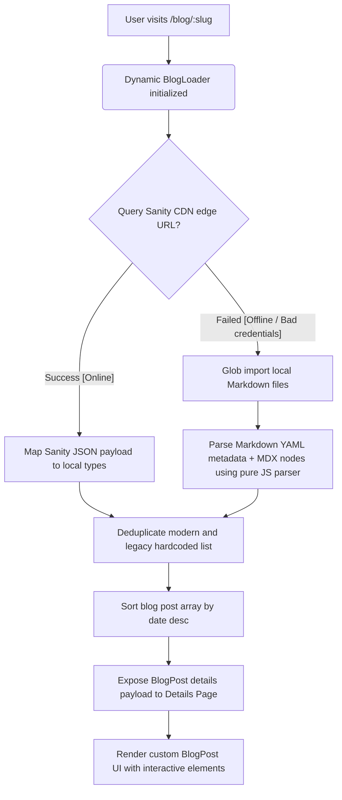

# Emmanuel Odebiyi Portfolio: Project Progress & State Ledger

This document serves as a persistent, single source of truth tracking the development progress, system architecture, resolved challenges, and future milestones for Emmanuel Odebiyi's portfolio website. It is designed to ensure seamless handoffs between developers and AI coding assistants, aligning them instantly on the project's exact state.

---

## 🚀 1. Current Project State & Operational Status
* **Live Website URL:** `https://emmanuelodebiyi.name.ng`
* **Hosting Platform:** **Cloudflare Pages** (configured with standard Single Page Application routing redirects)
* **Active Content Management System:** **Sanity Headless CMS (v5)**
* **Active Repository Status:** Clean working tree, fully compiled, type-checked, and successfully generated production build.

### 📋 Feature Alignment Matrix
| Component / Integration | Status | Tech / Tool Stack | Purpose |
| :--- | :---: | :--- | :--- |
| **Sanity Edge CDN Queries** | 🟢 ACTIVE | Standard REST API `apicdn.sanity.io` | Dynamic runtime data fetching |
| **Fail-safe Local Markdown Fallback** | 🟢 ACTIVE | Vite `import.meta.glob` | Offline capability & 100% uptime |
| **Monospace CLI Terminal Block** | 🟢 ACTIVE | Custom React component | Renders code blocks with copy-to-clipboard |
| **System Workflow Diagram Builder** | 🟢 ACTIVE | Custom AST node relational parser | Dynamic flowchart card rendering from string annotations |
| **Scrollspy Table of Contents** | 🟢 ACTIVE | Custom viewport position listener | Side navigation with active section highlights |
| **Local Bookmarks / Storage** | 🟢 ACTIVE | HTML5 `localStorage` | Client-side bookmark saving |
| **Related Insights Recommendation** | 🟢 ACTIVE | Custom tag intersection scoring | Suggests contextually relevant blog posts |
| **Hosted Studio Redirects** | 🟢 ACTIVE | Cloudflare `public/_redirects` | Forwards website `/admin` requests to Cloud Sanity |

---

## 🛠️ 2. Sanity CMS Data Model & Integration Details

### 🔹 Studio Parameters
* **Sanity Project ID:** `96ilx2qv` (Hardcoded as high-reliability fallback in dynamic loader)
* **Sanity Dataset:** `production`
* **Hosted Studio Cloud URL:** [https://emmanuelodebiyi.sanity.studio](https://emmanuelodebiyi.sanity.studio)
* **Local Development Studio:** `/sanity-studio` (Accessible locally on `http://localhost:3333`)
* **Framework Standard:** Upgraded to **Sanity v5 (`^5.28.0`)** and **React 19 (`^19.2.2`)** for native compatibility.

### 🔹 Schema Abstraction Types (`/sanity-studio/schemas`)
1. **`post` (Blog Article Document):**
   * *Fields:* `title`, `slug`, `date`, `author`, `authorImage`, `authorBio`, `readTime`, `excerpt`, `image`, `heroImage`, `tags`, `hook`, `takeaways`.
   * **`content` (NEW — blockContent):** 🟢 WordPress-style visual rich text editor. Authors write entire articles in a single canvas with **Ctrl+B** bold, **Ctrl+I** italic, **Ctrl+K** links. Custom embed blocks are inserted between paragraphs using the `+` button.
   * **`sections` (LEGACY — hidden):** Old segmented chapters array. Preserved for backward compatibility with existing articles but hidden in the CMS UI.
2. **`blockContent` (Rich Text Array — NEW):**
   * Standard text formatting: Bold, Italic, Underline, Code, Strikethrough, Links.
   * Heading styles: H2, H3, H4, Blockquote.
   * List types: Bullet, Numbered.
   * Custom visual embed blocks inserted inline:
     * 💻 `terminalEmbed`: CLI code console with language selector.
     * 🔀 `flowchartEmbed`: Workflow diagram with node connection syntax.
     * 💡 `exampleEmbed`: Amber playbook callout panel.
     * ✨ `highlightEmbed`: Blue gradient highlight callout.
     * 🧩 `simplificationEmbed`: Ivory plain-terms card.
     * 💬 `quoteEmbed`: Large pull quote with author citation.
     * 📊 `tableEmbed`: Structured comparison grid.
     * 🖼️ Inline images with alt text and captions.
3. **`blogSection` (LEGACY — kept for backward compatibility):**
   * *Fields:* `heading`, `content`, `list`, `example`, `highlight`, `simplification`, `quote`, `table`.

---

## 🗺️ 3. Dynamic Blog Architecture Details

The system deploys a high-performance content pipeline designed to give you a dynamic, visual publishing experience while preserving **100% of Vite portfolio load speed, GSAP micro-animations, and Three.js capabilities**.

### ⚙️ Content Pipeline & Fallback Topology


### 🔹 Dynamic Loader Features (`src/data/blogLoader.ts`)
* **Zero-SDK REST API Edge Queries:** Queries the Sanity Edge CDN via bare `fetch()` commands rather than bundling massive Sanity client client-side libraries. Keeps frontend JS bundle lightweight.
* **Pure JavaScript YAML Parser:** Implemented custom YAML-block parser (`parseSimpleYAML`) to process local markdown frontmatter metadata and lists. Prevents bloating compile times and runtime import failures.
* **Fail-safe Fallback Bridge:** If the user is offline or the Sanity service is unreachable, it eagerly falls back to offline-ready markdown articles inside `/content/blog/*.md` parsed instantly at runtime.

### 🔹 Custom Article Rendering Layout (`src/pages/BlogPost.tsx`)
* **Monospace Terminal Code Simulator:** Embeds a beautiful, dark-space command-line box with styling mimicking standard terminal controls, complete with click-to-copy code blocks.
* **Smart Workflow Diagram Parser:** Instead of pulling in heavy layout engines (e.g., Mermaid.js), the page uses a built-in AST connection crawler. It scans text sections for node connector strings (e.g., `-->` relations and custom labels), automatically outputting highly responsive system workflow visual flowchart cards.
* **Viewport Scrollspy & Sidebar Index:** Monitors user scroll actions to dynamically highlight active sections on the sidebar Table of Contents.
* **Interactive Utility Panel:** Features floating reading progress bars, localized browser-stored bookmark toggling, copy-to-clipboard sharing, checkable takeaways, and smart article matching.

---

## 🩹 4. Solved Technical Pitfalls (Important Context for Future Agents)

1. **Avoided Heavy Library Runtime ReferenceErrors:**
   * *Problem:* Standard Node-based YAML modules fail compilation when bundled for browser deployment under Vite.
   * *Fix:* Programmed a pure, robust JS regex-based YAML parser inside `blogLoader.ts`. Do not import node-only files inside frontend modules.
2. **Cloudflare Environment Variable Isolation:**
   * *Problem:* Build triggers on Cloudflare sometimes fail to correctly bind `VITE_SANITY_PROJECT_ID` inside client-side JS.
   * *Fix:* The project ID (`96ilx2qv`) is hardcoded directly inside `blogLoader.ts` as a reliable fallback string.
3. **Admin SPA Route Interference:**
   * *Problem:* Visiting `/admin` triggered client-side Vite React router mismatches, leading to empty white pages.
   * *Fix:* Configured native Cloudflare routing overrides inside `public/_redirects` forwarding any `/admin` or `/admin/*` queries directly to [https://emmanuelodebiyi.sanity.studio](https://emmanuelodebiyi.sanity.studio) (302 redirects).

---

## 💻 5. Local Testing & Execution Manual

### 🔹 Run the Portfolio Website Locally
1. Ensure you are in the workspace root directory: `c:\Users\HP\Documents\Portfolio_Website`
2. Run standard dev server via `.cmd` execution bypass:
   ```powershell
   npm.cmd run dev
   ```
3. Open `http://localhost:5173` to browse the interactive site.

### 🔹 Run the Local Sanity CMS Studio
1. Enter the Sanity directory:
   ```powershell
   cd sanity-studio
   ```
2. Start the local server:
   ```powershell
   npm.cmd run dev
   ```
3. Open `http://localhost:3333` to add, edit, or delete articles. Deploy changes to the live CMS by running `npm.cmd run deploy`.

---

## 🎯 6. Clear Next Action Items for the Next Agent

If you are the next AI agent or developer picking up this project, please focus on the following sequential milestones:

1. **[ ] Trigger Cloudflare Pages Rebuild:**
   * The local code compiles and builds successfully (verified with Vite production output passing flawlessly on 2026-05-31).
   * Ensure that the latest master commits (specifically custom `BlogPost.tsx` enhancements and dynamic parser logic) are built and deployed on Cloudflare Pages. If auto-rebuild is not active, log in to the Cloudflare dashboard and trigger the build manually.
2. **[ ] Verify Production CMS Sync:**
   * After the live site rebuild completes, go to [emmanuelodebiyi.sanity.studio](https://emmanuelodebiyi.sanity.studio) and publish a test blog post.
   * Verify that the new post details card dynamically queries the Sanity Edge CDN and appears immediately on the live website `/blog` page without manual code deployment.
3. **[ ] Audit Custom Diagram Parsing:**
   * Test workflow diagrams in published articles. Write text containing `node1("Example Step") --> node2("Next Step")` inside Sanity editor sections and ensure the details page transforms them into the premium visual flowchart cards.
4. **[ ] Test Offline Mode Performance:**
   * Go to the browser's developer tools Network tab, toggle **Offline Mode**, and verify that the blog loader gracefully falls back to local pre-compiled files (`/content/blog/how-i-save-15-hours-every-week-with-content-automation.md`), maintaining a 100% functional user experience.
